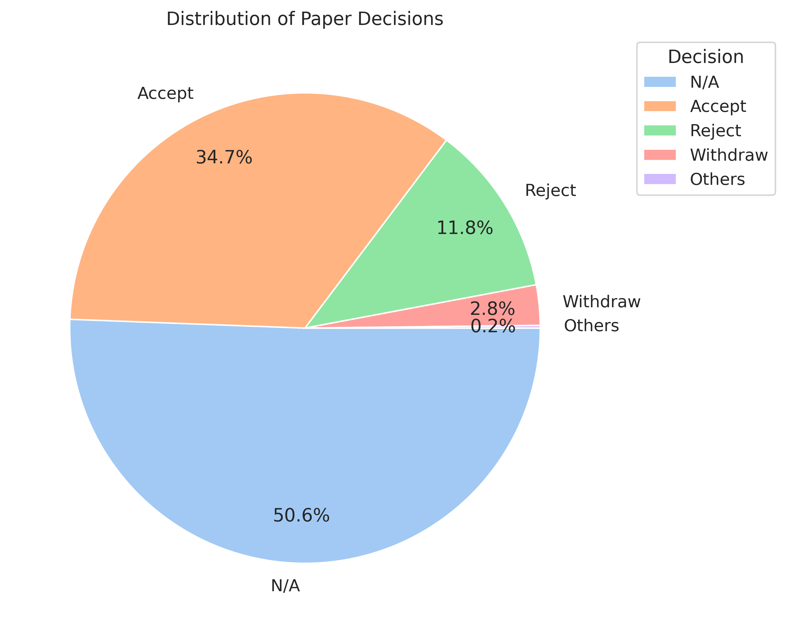
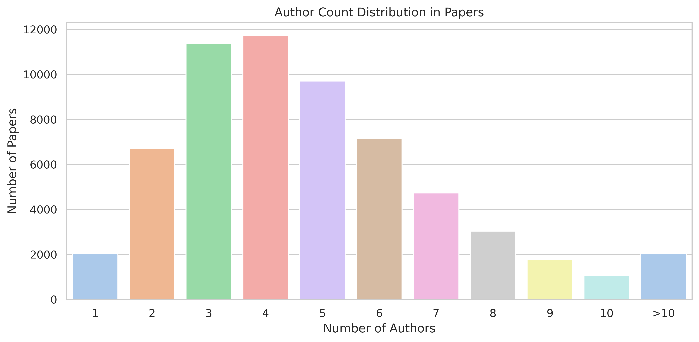
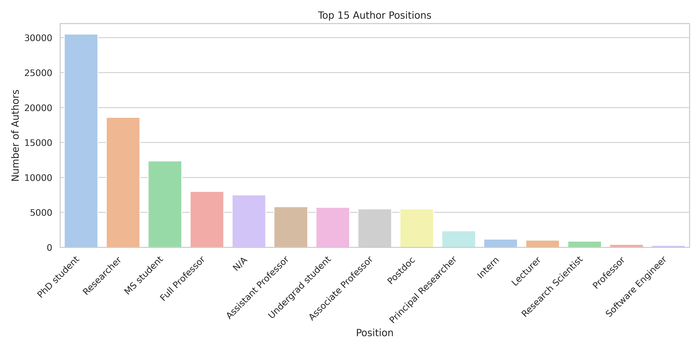
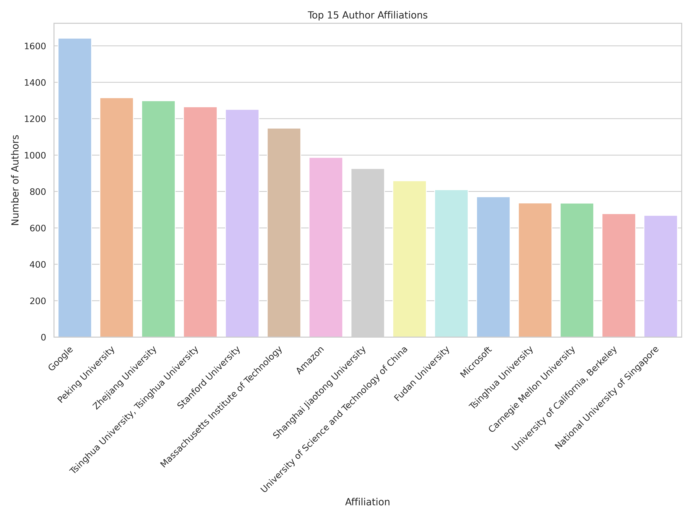
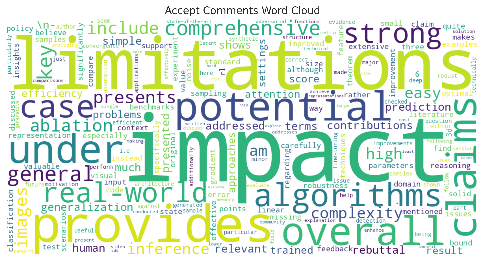
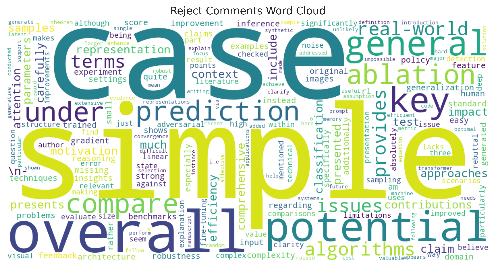

# OpenReview Spider

## Data Source

From OpenReview API

* 512 available conference/workshops (2755 in total)
* 70383 submissions (many conferences forbid access to rejected/withdrawn papers)
* 109784 authors
* 302032 paper-author pairs

### Basic Data Distribution

### Word Cloud of Accept and Reject Reviews

removed common words

