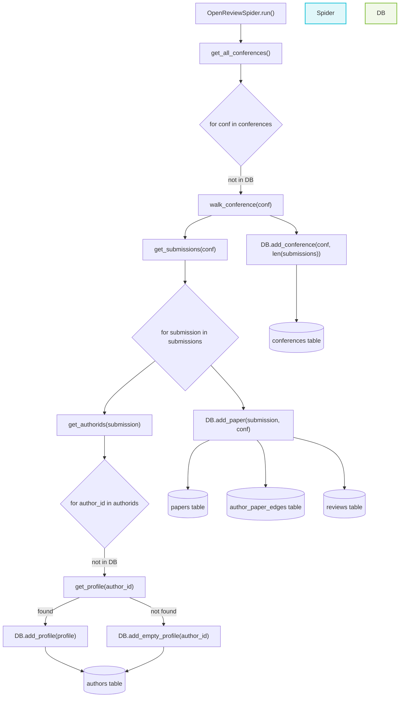

# OpenReviewSpider

## Archtecture

* [x] MetaData (Json)
* [x] DataBase (Sqlite)
* [x] Incremental Update
* [x] Query Co-Author by date (COI-assist)




## How to Run

### Requirements

```shell
python==3.12
openreview-py>=1.50
requests>=2.22.0
tqdm
```

### Set Account

Edit [src/main.py](src/main.py), set OpenReview Account and Password

```python
import openreview
from openReviewSpider import OpenReviewSpider
    
if __name__ == '__main__':
    client = openreview.api.OpenReviewClient(
    baseurl='https://api2.openreview.net',
    username='your_username',  # Replace with your OpenReview username
    password='your_password'  # Replace with your OpenReview password
    )
    
    spider = OpenReviewSpider(client, '~/data/')
    spider.run()
    print("OpenReview Spider finished running.")

```

### Run

```shell
cd src
python main.py
```

## Data Analysis

see [DataVisualization](./DataVisualization.md)


